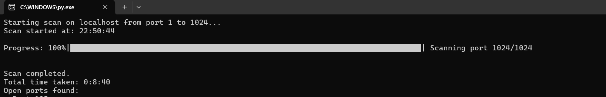

# TerminalPort 📟
A lightweight port scanner that checks IP addresses for open ports.

Features 🦖
- Local and Remote Scanning: Choose to scan either localhost or any specified IP address.
- IPv4 and IPv6 Support: The script can handle both IPv4 and IPv6 addresses.
- Progress Display: A progress bar indicates the progress of the scan.

 

(You can adjust the port range in the Python file.)
